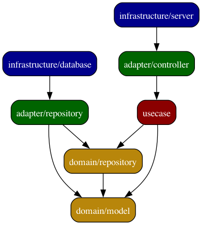

# 概要

# アーキテクチャ
クリーンアーキテクチャを採用。内側の層が外部に依存することは許可されません。

- infrastructure ... 技術詳細に関するコード置き場 ex. DB, WEBフレームワーク
  - router ... パスやメソッドなどプロトコルに依存するリクエストを一般的な形式に変換して変換してコントローラにルーティングする
    - リクエストのパース処理（技術依存）
    - レスポンスの構成（技術依存）
  - presenter ... controllerのレスポンスをクライアントが期待するモデルに変換する
    - 外部の技術詳細とかにpbに依存するよなあ、ぶっちゃけrouterで変換すればいいんじゃ？と思ってしまう
- adapter ... 外部とのやり取りの接点となるコード置き場
  - controller ... routerから受け取ったリクエストをハンドラ（usecase）にルーティングする。バリデーションはここで行う
    - バリデーション（技術非依存）
    - 対応しているユースケースごとにコントローラを分けている（必要か？）
  - repositoryimpl ... ドメインモデルの参照・操作の実装に関連するコード置き場
- usecase ... ビジネスロジックに関するコード置き場
    - usecaseごとにファイルを分けている
- domain ... ドメインロジックに関するコード置き場
  - model ... ドメインモデルに関するコード置き場
  - repository ... ドメインモデルに対する参照・操作の定義置き場

# 参考
- protoをdtoに変換すべきかの議論
  - ref: https://www.reddit.com/r/golang/comments/rdkqwv/grpc_use_the_generated_proto_as_a_model/
  - protoを完全にアプリケーション内のモデルとして利用すべきという意見もあるのか...
    - トランスポート専用じゃないよという主張はわかるけど全体が技術依存になるし、他のライブラリのサポート受けられなくなるケース多そう
  - 半構造化データをなるべく構造保った状態でRDBに保存する方法としてprotobufを使う場合もあるとか
    - ref: https://tech.layerx.co.jp/entry/2023/11/16/140041
